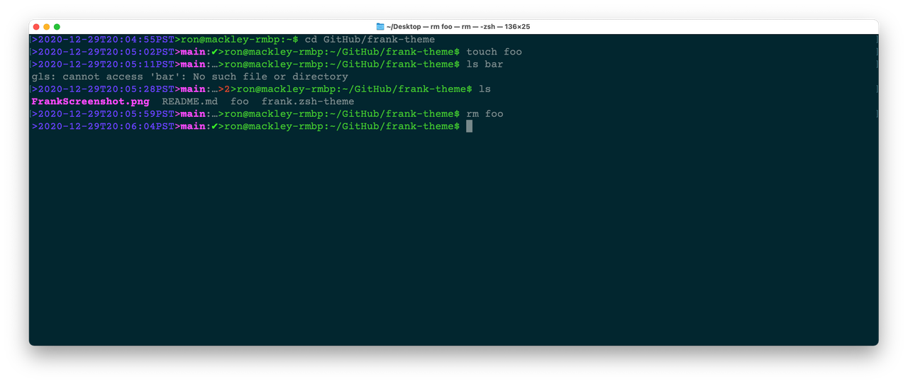

# Frank - A Simple Theme for Oh-My-Zsh

Theme oh-my-zsh like the cool kids! But be spartan and kind of old school.

## What to know

Frank is frankly, frank. Frank keeps to the point, displaying information compactly but readably on a single line. Frank keeps to the facts and only tells you extra things when they are important.

Frank is simple, no line art, no RPROMPTs, no blinkenlights. Just a prompt with some useful data.

Frank depends on the `git` and `git-prompt` plugins.

## What does Frank tell you?

- Timestamp - Frank will ell you about when the prior command finished, get some idea of how long that window has been logged in, or simply see what time it is.
- Username, hostname, and path - Who you are, what planet you're on, and where you are. All in a format that copy-paste friendly for scp, or rcp if you remember that! (You might need to bring the domain name, Frank can be terse.)
- Git status - If stumble into a Git repository Frank will tell you which branch you are in and the status of the repository. Otherwise he keeps his mouth shut.
- Exit status - Frank will tell you the exit status of the last comment, iff the status is non-0. If it's 0, what's there to talk about?
- Got root? - Frank will tell you whether you're root (#) or another user ($)

Timestamp, Git status, Exit Status, and User@Host:Path are angle-bracket '**>**' delimited.

## Screenshot

Here's a little of what how frank looks when:

- In a directory
- In a dirty Git repository
- After a non-zero exit
- In a clean Git repository

# Notes

Have fun and do good work with this.

-*Ron*
